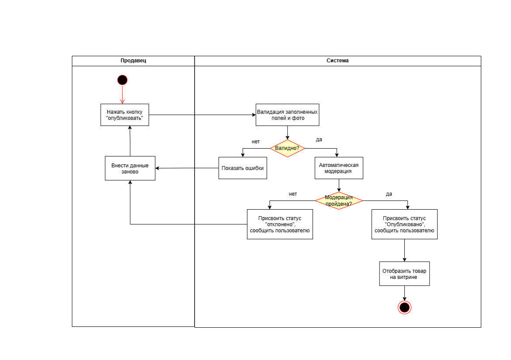
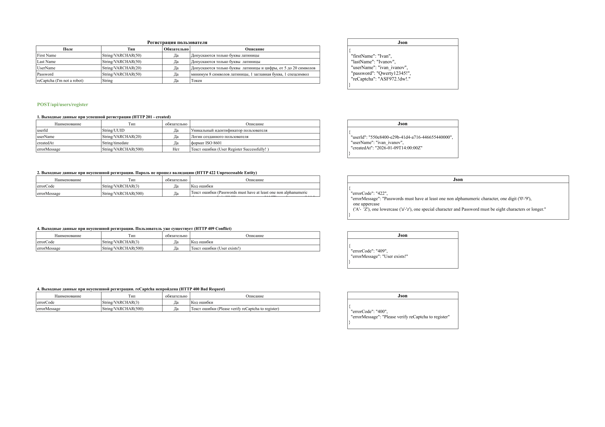
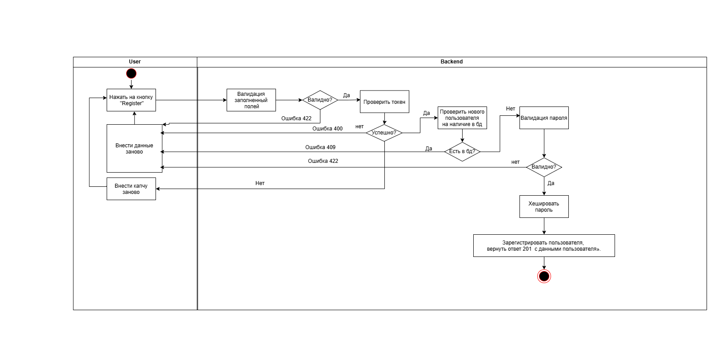

# Тестовое задание Junior Fullstack-Аналитик

## Задача 1: BPMN диаграмма процесса выдачи оборудования
Описание процесса и выявленные противоречия.

## Задача 2: Публикация товаров на маркетплейсе
**User Story:**  
Как продавец, я хочу опубликовать свой товар на маркетплейсе. чтобы  он стал доступен для поиска и покупки на маркетплейсе.  
 	**Acceptance criteria:**

1. Кнопка публикации доступна только после заполнения всех обязательных полей.  
2. Продавец может сохранить объявление в статусе “черновик”  без публикации.  
3. Цена на товар должна быть указана в российских рублях, число должно быть положительным, не равно  0 или больше 999 999 999\.   
4. Товар не может быть опубликован без фотографии.   
5. Формат и размер фотографии должен соответствовать стандартам маркетплейса   
   (Формат: JPG, PNG. Размер: от 1024х1024 px, не более 5 Мб).  
6. После нажатия кнопки “опубликовать” объявление уходит на автомодерацию и получает соответствующий статус.   
7. После прохождения модерации продавец получает уведомление в личном кабинете о статусе публикации товара, опубликован или отклонен.   
     
   

**Use Case:**

1. *Название:* Публикация товара на витрине маркетплейса.   
   1. *Акторы* : Продавец, Система.   
   2. Предусловие: Пользователь авторизован на маркетплейсе как продавец, карточка товара создана  
   3. *Основной поток:*  
      * Продавец  нажимает на кнопку публикации.  
      * Система выполняет техническую валидацию данных (наличие фото, корректность цены)  
      * Система запускает автоматическую модерацию.  
      * После проверки данных система меняет статус товара на “опубликован”   
      * Продавец получает уведомление о об успешной публикации товара и отображает товар на витрине маркетплейса.  
   4. *Альтернативный поток:*  
      * Система обнаруживает несоответствие формата фото или цены. Система подсвечивает поля с ошибками и выводит подсказки  
      * Товар не прошел модерацию, Система меняет статус на “отклонено”, выводит причину отказа и рекомендации по исправлению.   
      * Технический сбой. Если система недоступна, пользователь получает уведомление “Сервис временно недоступен, попробуйте позже”. Статус товара остается “черновик” 

## Задача 3: API Регистрации
Спроектированный метод `POST /api/register`.

